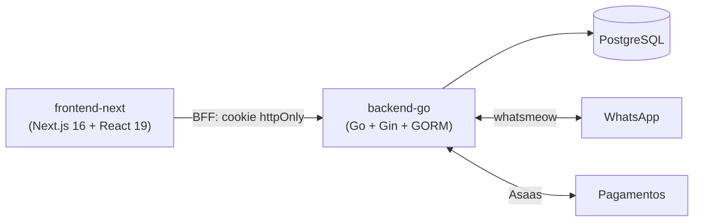

<div align="center">


# CRM IMOB

**Sistema de gestão imobiliária SaaS multi-tenant** — clientes, imóveis, locação,
financeiro, pagamentos e WhatsApp, tudo em um só lugar.

[](backend-go)
[](frontend-next)
[](frontend-next)
[](backend-go)
[](frontend-next)
[](#comunicação-e-operação)

</div>

---

## 📑 Sumário

- [O que o sistema faz](#-o-que-o-sistema-faz)
- [Arquitetura](#️-arquitetura)
- [Stack](#-stack)
- [Rodando localmente](#-rodando-localmente)
- [Status da migração](#-status-da-migração)

---

## 📋 O que o sistema faz

Centraliza todo o ciclo de negócio de uma imobiliária ou correspondente bancário —
isolado por organização (**tenant**) na mesma instalação, cada uma enxergando só os
próprios dados.

### 🏠 Vendas e cadastro
- **Clientes** — cadastro completo (dados pessoais, financeiros, cônjuge, fiador,
  documentos), funil de status (aguardando aprovação → proposta → documentação →
  aprovado/reprovado → concluído), upload e conversão de documentos.
- **Imóveis** — portfólio para venda, situação (disponível/reservado/vendido),
  imagens, busca e vitrine pública com SEO.
- **Propostas, visitas** e **simulador de financiamento** (SAC e PRICE).
- **Corretores e correspondentes** — cadastro de equipe, ranking de performance,
  permissões por papel (administrador / corretor / correspondente).

### 🔑 Locação (aluguéis)
- Portfólio de imóveis para locação, inquilinos, contratos com reajuste (IGPM),
  vistorias, chamados de manutenção.
- **Régua de cobrança automatizada** (5 etapas: D-5 a D+15) com notificação via
  WhatsApp.
- **Repasses a proprietários** com cálculo de comissão e transferência PIX.
- **Portal do inquilino** — acesso próprio (login por CPF) para consultar
  cobranças, recibos e contrato.

### 💰 Financeiro
- Receitas, despesas, comissões e fluxo de caixa.
- **Pagamentos via Asaas** (boleto, PIX, cobrança avulsa e recorrente) com webhook
  de confirmação idempotente.
- Billing do próprio SaaS: planos, assinaturas, feature gating e limites por
  plano.

### 📡 Comunicação e operação
- **WhatsApp** integrado (QR Code, envio de mensagens, notificações automáticas de
  status, documentos e pagamentos) via conexão direta ao protocolo — sem API paga
  de terceiros.
- **WebSocket nativo** para atualizações em tempo real.
- **Dashboards** com gráficos (funil de clientes, evolução mensal/semanal,
  portfólio de imóveis e aluguéis, indicadores financeiros), notificações e
  alertas.
- **Painel Super Admin** — métricas SaaS (MRR/ARR, churn, assinaturas por plano),
  gestão de tenants e planos.

### 🔒 Multi-tenancy e segurança
- Isolamento automático de dados por organização em toda consulta ao banco.
- Autenticação JWT com sessão deslizante.
- Sessão do novo frontend via **cookie httpOnly** — zero token em `localStorage`.

---

## 🏗️ Arquitetura

Backend em Go e frontend em Next.js — a migração do stack original (Node +
React/Vite) foi concluída; os componentes antigos foram removidos do repositório.



| Componente | Papel |
|---|---|
| 🐹 `backend-go` | API do sistema — backend real e definitivo. |
| ▲ `frontend-next` | Frontend único, em Next.js, focado em SEO nas páginas públicas e em segurança de sessão. |

---

## 🧩 Stack

### 🐹 Backend — `backend-go`

| Camada | Tecnologia |
|---|---|
| Linguagem | **Go** |
| Web framework | [Gin](https://github.com/gin-gonic/gin) |
| ORM / Banco | [GORM](https://gorm.io) + **PostgreSQL** (driver `pgx`) |
| Migrations | [golang-migrate](https://github.com/golang-migrate/migrate) — schema versionado, recria o banco do zero em qualquer ambiente |
| Autenticação | JWT ([golang-jwt](https://github.com/golang-jwt/jwt)) — access token (1h) + refresh (7d) |
| WhatsApp | [whatsmeow](https://github.com/tulir/whatsmeow) — conexão direta ao protocolo, sem API paga |
| Tempo real | WebSocket nativo ([gorilla/websocket](https://github.com/gorilla/websocket)) — sem Socket.IO |
| Pagamentos | [Asaas](https://www.asaas.com/) (boleto, PIX, cobrança recorrente, webhook) |
| Jobs agendados | [robfig/cron](https://github.com/robfig/cron) — régua de cobrança, sincronização, relatórios |
| Multi-tenancy | Isolamento automático via `context.Context` + callbacks globais do GORM |

Arquitetura interna em módulos por domínio
(`internal/modules/{clientes,imoveis,alugueis,financeiro,pagamentos,whatsapp,
dashboards,superadmin,...}`), cada um em camadas `handler → service → repository`.

### ▲ Frontend — `frontend-next`

| Camada | Tecnologia |
|---|---|
| Framework | **Next.js 16** (App Router) |
| React | **React 19** |
| Estilo | **Tailwind CSS v4** (CSS-first) + **shadcn/ui** (última versão) |
| Autenticação | **Cookies httpOnly** via BFF — o JWT nunca é exposto ao JavaScript do navegador |
| Renderização | Server Components com dados direto do servidor (SSR) no CRM; SSR/SSG + metadados dinâmicos (`generateMetadata`, Open Graph) nas páginas públicas |

> **Por que Next.js?** As páginas públicas (vitrine de imóveis, landing, detalhe
> de cada imóvel) precisam de SEO real e preview correto ao compartilhar links no
> WhatsApp/redes sociais — algo que uma SPA pura não entrega. A escolha também
> eliminou token em `localStorage` (superfície de ataque XSS).

---

## 🚀 Rodando localmente

O `backend-go` é obrigatório para o frontend funcionar.

### 🐹 Backend
```bash
cd backend-go
cp .env.example .env        # configurar DB_*, JWT_SECRET_KEY, etc.
migrate -path migrations -database "$DATABASE_URL" up   # recria o schema do zero
go run ./cmd/api
```

### ▲ Frontend
```bash
cd frontend-next
npm install
cp .env.local.example .env.local   # configurar API_URL (privada, aponta pro backend-go)
npm run dev
```

---

## 📊 Status

| Frente | Estado |
|---|---|
| Backend Node → Go | ✅ Migrado — todos os módulos de negócio implementados |
| Schema do banco | ✅ Versionado via `golang-migrate`, reproduzível do zero em qualquer ambiente |
| Frontend Vite → Next.js | ✅ Migrado — `frontend-next` é o único frontend do projeto |
| Design system | 🚧 React 19 + Tailwind v4 + shadcn/ui adotados; refinamento visual de cada página é uma etapa em andamento |

Consulte `backend-go/STATUS.md` e `frontend-next/MIGRATION.md` para o
detalhamento técnico completo de cada frente.

<div align="center">

---

Feito com 🧡 para simplificar a gestão imobiliária.

</div>
